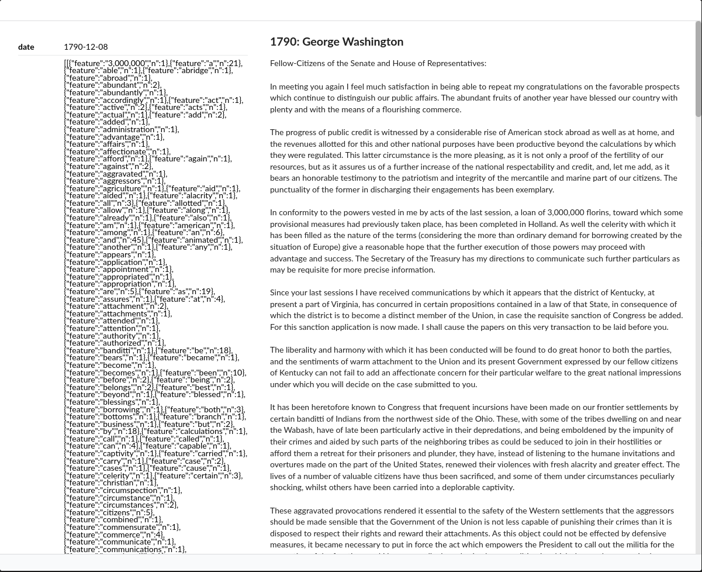
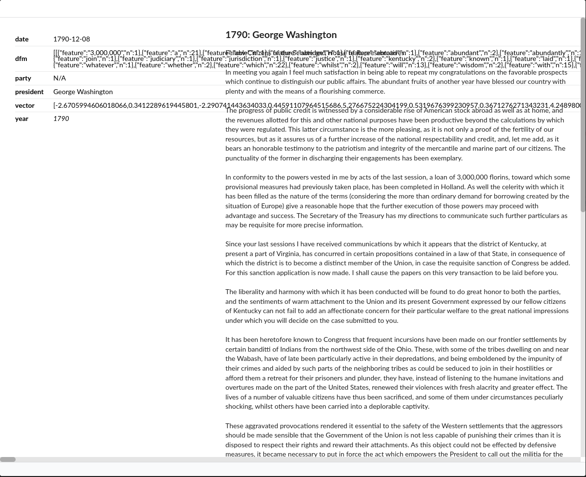

# actioncat

`actioncat` is part of the AmCAT-suite of packages for text analysis. It
provides users with the ability to preprocess texts using the Docker
infrastructure. This allows users to write preprocessing chains, test
them locally and then execute the processing steps on a server that has
access to an index on an AmCAT instance. `actioncat` makes it possible
to rerun processing regularly (e.g., once a day and when new data is
found) or to ask admins of an index to run preprocessing on text data
that the original user does not have access to – extending the
non-consumptive research capabilities of amcat4.

# Workflow Examples

We offer two example *actions* (which is what we call predefined
workflows that are packaged in a Docker image/container), one in `R`,
one in `Python`:

- The `R` action adds a tidy document-feature representation field to
  the index
- The `Python` action adds a document embeddings field to the index

Both of these actions are destructive preprocessing in the sense that
the original text cannot be reconstructed from the new field. This makes
these actions well suited for indexes where the full text can not be
shared because of copyright, privacy or other concerns. Using AmCAT’s
fine grained access control features, the full text can be hidden from
users without specific permissions, but the preprocessed data can still
be shared with a wider audience.

# Usage

Usage for `R` and `Python` is slightly different, but the sections below
are written so you only need to read the one you’re interested in (you
can skip the other one).

## R Action Example: Tidy Document-Features

First, spin up an instance of the AmCAT suite using
[Docker](https://docs.docker.com/engine/install/) and [Docker
Compose](https://docs.docker.com/compose/install/) if you haven’t
already (you can find a more detailed explanations in the [AmCAT
manual](https://amcat.nl/book/02._getting-started.html)):

``` bash
# download our docker compose file with curl or manually
curl -O https://raw.githubusercontent.com/ccs-amsterdam/actioncat/main/actions/dfm/docker-compose.yml
# run docker compose to download and start the AmCAT applications
docker-compose up --pull="missing" -d
# create a test index to use in this example
docker exec -it amcat4 amcat4 create-test-index
```

You can use the actions with the same basic approach:

``` bash
# download our docker compose file with curl or manually
curl -O https://raw.githubusercontent.com/ccs-amsterdam/amcat4docker/main/docker-compose.yml
# run docker compose to download and start the AmCAT applications
docker-compose up --pull="missing" -d
```

The container will run until it has added a tidy document-feature
representation to all texts in the test index. You can check this via
the web interface at <http://localhost/>:



or using the `amcat4r` package:

``` r
if (!requireNamespace("amcat4r", quietly = TRUE)) remotes::install_github("ccs-amsterdam/amcat4r")
library(amcat4r)
amcat_login("http://localhost/amcat")
sotu_dfm <- query_documents(index = "state_of_the_union", queries = NULL, fields = c(".id", "dfm"))
sotu_dfm
```

    # A tibble: 232 × 2
       .id      dfm           
       <id_col> <list>        
     1 9d8…0d0  <list [3,370]>
     2 846…068  <list [2,176]>
     3 2b6…aa5  <list [2,895]>
     4 4f3…8bf  <list [3,172]>
     5 c36…4b0  <list [3,739]>
     6 5a2…8ba  <list [3,745]>
     7 8b0…5f2  <list [3,927]>
     8 484…893  <list [3,308]>
     9 a3a…a70  <list [2,554]>
    10 57c…840  <list [1,729]>
    # ℹ 222 more rows

You can control which AmCAT instance this is used on, which index it is
applied on, the name of the text field and the name of the new dfm field
by changing the environment variables in the file `docker-compose.yml`
in `actions/dfm`:

    version: "3.8"
    services:
      action-dfm:
        image: ccsamsterdam/amcat-action-dfm:4.0.13
        build: .
        network_mode: "host"    
        environment: # behaviour of the R script is controlled through these variables
          - amcat4_host=http://localhost/amcat
          - index=state_of_the_union
          - queries=NULL
          - text_field=text
          - dfm_field=dfm
        # for authentication, this container needs access to the httr2 cache directory. 
        # You can find it with `rappdirs::user_cache_dir("httr2")`
        # volumes:
        #   - ~/.cache/httr2:/root/.cache/httr2 # [local path]:[container path]

So far, we ran this on an instance without authentication. If we [turn
on authentication](https://amcat.nl/book/04._sharing.html), we need to
also give the container access to a valid token. You can do this by
giving the action access to your token file. To create a token file,
first log into the instance:

``` r
amcat_login("http://localhost/amcat", cache = 1L)
```

When `cache = 1L` is selected, a token file is written to your local
computer. You can find it by following the path returned by:

``` r
rappdirs::user_cache_dir("httr2")
```

    [1] "~/.cache/httr2"

Now you could link this directory to the Docker container by changing
the commented out lines in `docker-compose.yml` to:

        volumes:
          - ~/.cache/httr2:/root/.cache/httr2 # [local path]:[container path]

Note that the path returned by `rappdirs::user_cache_dir("httr2")` is
the local path and is added before the `:`. If the action is run on a
server (which is probably your use case), you first need to copy the
token there (e.g., copy it to `/srv/amcat/token` and then link this
folder to `/root/.cache/httr2` in the container)..

## Python Action Example: Text Embeddings With `spaCy`

First, spin up an instance of the AmCAT suite using
[Docker](https://docs.docker.com/engine/install/) and [Docker
Compose](https://docs.docker.com/compose/install/) if you haven’t
already (you can find a more detailed explanations in the [AmCAT
manual](https://amcat.nl/book/02._getting-started.html)):

``` bash
# download our docker compose file with curl or manually
curl -O https://raw.githubusercontent.com/ccs-amsterdam/amcat4docker/main/docker-compose.yml
# run docker compose to download and start the AmCAT applications
docker-compose up --pull="missing" -d
# create a test index to use in this example
docker exec -it amcat4 amcat4 create-test-index
```

You can use the actions with the same basic approach:

``` bash
# download our docker compose file with curl or manually
curl -O https://raw.githubusercontent.com/ccs-amsterdam/actioncat/main/actions/embeddings/docker-compose.yml
# run docker compose to download and start the AmCAT applications
docker-compose up --pull="missing" -d
```

The container will run until it has added a document embedding to all
texts in the test index. You can check this via the web interface at
<http://localhost/>:



or using the `amcat4py` package:

``` python
# !pip install git+https://github.com/ccs-amsterdam/amcat4py
from amcat4py import AmcatClient
amcat = AmcatClient("http://localhost/amcat")
sotu_embedded = list(amcat.query("state_of_the_union", fields=["_id", "vector"]))
print(sotu_embedded[0])
```

    {'_id': '9d8c57b3d4071427d644c0782d4f033df0d20c4aa1e72b0cdc2f60d0', 'vector': [-2.584941864013672, 0.5668525099754333, -2.200467824935913, 0.5146863460540771, 5.066240310668945, 0.8432658910751343, 0.36580637097358704, 4.3951826095581055, -0.11230597645044327, -1.178401231765747, 7.047341823577881, 1.9718612432479858, -4.112068176269531, 1.424439549446106, 0.5502058267593384, 2.0605266094207764, 1.0894652605056763, -0.31645071506500244, -2.0473666191101074, -2.902946949005127, 1.2722121477127075, -1.1476410627365112, -1.6604031324386597, 0.2802365720272064, 0.5961411595344543, -1.543977975845337, -2.5713694095611572, -0.775090754032135, -1.0820937156677246, 1.5016242265701294, 1.5160459280014038, -0.8956965804100037, -1.1006133556365967, -2.5507192611694336, -2.701586961746216, -0.5872349739074707, -0.631312906742096, 1.6670054197311401, 1.186191439628601, 1.061599850654602, 0.3877054750919342, 0.8494362235069275, -0.3088042140007019, 0.3823668360710144, -2.153640031814575, 1.866379976272583, 1.231679916381836, -2.364393711090088, -0.8733667731285095, 1.6099239587783813, -1.655489444732666, 2.65228271484375, 0.023157555609941483, -5.952343940734863, -0.7657691836357117, 0.6578642129898071, -0.3005870580673218, 1.2808358669281006, 0.9008498191833496, -0.672094464302063, 0.45401886105537415, -1.5570497512817383, 0.03167137876152992, -1.7754989862442017, 2.5763115882873535, 2.0212059020996094, -2.674398422241211, -3.471515417098999, 1.5026280879974365, 2.5707123279571533, -0.6496877670288086, -0.23335707187652588, -2.4855360984802246, -0.3093172609806061, -0.6226382851600647, 1.6102527379989624, -3.9365828037261963, 2.833744525909424, -3.8103864192962646, -0.044854484498500824, -5.142195224761963, 0.46563324332237244, 1.0169132947921753, 1.0954638719558716, 2.61641526222229, 0.5026425123214722, -2.8905444145202637, -3.044506311416626, 1.5454736948013306, -0.4041752219200134, -0.808468222618103, -0.4676092863082886, 2.2286782264709473, -4.199618816375732, 1.0473556518554688, -1.7924443483352661, 1.3732800483703613, -1.0911015272140503, 0.2563754618167877, 2.5803818702697754, 3.0968947410583496, 1.4841924905776978, 2.6305367946624756, 2.9157862663269043, -0.9590944647789001, 4.432043075561523, 0.7367916703224182, -3.1911537647247314, -0.35465458035469055, -3.1122894287109375, 1.691697120666504, 1.1451504230499268, -2.382159948348999, 1.1710987091064453, 0.8634416460990906, 1.0250279903411865, -0.9047765135765076, 0.07269667834043503, 0.45773693919181824, -1.3290343284606934, -1.5820753574371338, -2.886862277984619, 0.32268404960632324, 1.1909834146499634, -1.5863275527954102, -4.179196357727051, 1.1167880296707153, -3.003782033920288, 2.988245964050293, -1.092992901802063, -3.06715989112854, -0.13621897995471954, 4.2800164222717285, -0.23796609044075012, -0.20181718468666077, 1.155486822128296, -2.379868984222412, -1.0468804836273193, 2.6384620666503906, -2.4276249408721924, -2.412808418273926, -0.9842107892036438, 0.3785341680049896, 1.6859591007232666, 1.708335518836975, 0.5838260650634766, -3.656418800354004, -0.5428900122642517, 1.150781512260437, 1.4076626300811768, -0.13962353765964508, 2.9407098293304443, -0.21171718835830688, 1.4861507415771484, -1.3935060501098633, 1.3930624723434448, 3.0058867931365967, -1.035820484161377, -2.402400016784668, -1.4585100412368774, -1.292585015296936, -2.077953338623047, -0.01879699155688286, 2.301854133605957, -2.25860857963562, -1.7647172212600708, -4.207658767700195, 0.9075959920883179, 0.6145652532577515, -0.03256196901202202, 1.2568700313568115, -0.5515148043632507, 2.7205402851104736, 0.28410622477531433, 1.7831575870513916, 0.025451069697737694, 0.1707054078578949, 0.018052898347377777, -2.496920108795166, -1.8580560684204102, -1.2590513229370117, -0.2776755094528198, 1.7353405952453613, -0.396554559469223, -1.2683058977127075, 0.08395708352327347, -2.0903429985046387, -0.1503172516822815, 1.1475242376327515, 2.343074321746826, -0.3999475836753845, -1.950765609741211, 0.16358475387096405, -2.094813346862793, 0.22349730134010315, 1.0098203420639038, -3.332139730453491, -0.2561648190021515, 0.19621588289737701, 0.3143840432167053, -1.1151881217956543, -1.7649505138397217, -0.7478153109550476, -2.2023534774780273, 3.599468469619751, 0.8574336171150208, -4.641427993774414, 2.0989866256713867, 0.34154778718948364, 0.0318860299885273, 1.623751163482666, 1.4383918046951294, -2.013988494873047, 2.1245787143707275, 0.6918537020683289, 3.053866386413574, 0.3791171610355377, -3.021493434906006, -0.5664780139923096, 0.16035036742687225, -2.569676637649536, 2.326643943786621, -0.04527980834245682, 0.5423280596733093, -2.309396982192993, -1.6286101341247559, 0.0977049320936203, 3.146799087524414, 1.9384592771530151, 0.45837098360061646, 2.796123504638672, -2.846338987350464, -0.39617133140563965, 2.359060287475586, 2.6399953365325928, 2.309579372406006, -1.8672691583633423, 0.5362843871116638, -0.9651347398757935, -0.6937834024429321, -0.8684667348861694, 0.3483287990093231, 1.1726738214492798, 0.4713929295539856, -1.356727957725525, 1.6005525588989258, -3.307621955871582, 0.6711251735687256, 0.767346978187561, 2.9441421031951904, 1.175682544708252, -2.943246364593506, -5.6484904289245605, -0.10708384215831757, 1.0593684911727905, -3.2646989822387695, 2.2512707710266113, -0.3676546812057495, 0.0648602545261383, 0.8843852877616882, -0.1750936508178711, 6.177722930908203, 3.802748441696167, 2.588360548019409, 2.4462761878967285, -0.6141838431358337, 0.23115231096744537, 2.4386918544769287, -3.3541793823242188, 0.5241560339927673, 1.179219126701355, -0.610063910484314, 0.6379163265228271, -2.2771782875061035, 0.7679356932640076, -0.7260420918464661, 2.047895908355713, -1.5714256763458252, -1.1100517511367798, 2.4508249759674072, 1.5290212631225586, 0.43283388018608093, 1.4115004539489746, 1.471404790878296, 2.508807897567749, -1.8215997219085693, 0.3210698664188385, 1.9978275299072266, -0.7658148407936096, 0.09383539855480194, 0.5851329565048218, -0.36808231472969055, -0.3150862157344818, 0.28831446170806885, -1.236081600189209, 1.303012728691101, 0.0914180725812912, -2.183215618133545, -2.8683719635009766, 1.2887440919876099]}

You can control which AmCAT instance this is used on, which index it is
applied on, the name of the text field and the name of the new field
with word embeddings by changing the environment variables in the file
`docker-compose.yml` in `actions/dfm`:

    version: "3.8"
    services:
      action-dfm:
        image: ccsamsterdam/amcat-action-embeddings:4.0.13
        build: .
        network_mode: "host"    
        environment: # behaviour of the R script is controlled through these variables
          - amcat4_host=http://localhost/amcat
          - index=state_of_the_union
          - text_field=text
          - vector_field=vector
          - spacy_model=en_core_web_md
          ## Optionally only apply to some documents
          # - queries="america"
          # - "filters={\"party\": \"Republican\"}"
        # for authentication, this container needs access to the httr2 cache directory. 
        # You can find it from Python with `__import__('appdirs').user_cache_dir("amcat4py")`
        # volumes:
        #   - ~/.cache/httr2:/root/.cache/httr2 # [local path]:[container path]

So far, we ran this on an instance without authentication. If we [turn
on authentication](https://amcat.nl/book/04._sharing.html), we need to
also give the container access to a valid token. You can do this by
giving the action access to your token file. To create a token file,
first log into the instance:

``` python
AmcatClient("http://localhost/amcat")
```

When this was successful, a token file is written to your local
computer. You can find it by following the path returned by:

``` python
from appdirs import user_cache_dir
user_cache_dir("amcat4py")
```

    '/home/johannes/.cache/amcat4py'

Now you could link this directory to the Docker container by changing
the commented out lines in `docker-compose.yml` to:

        volumes:
          - /home/johannes/.cache/amcat4py:/root/.cache/amcat4py # [local path]:[container path]

Note that the path returned by `user_cache_dir("amcat4py")` is the local
path and is added before the `:`. If the action is run on a server
(which is probably your use case), you first need to copy the token
there (e.g., copy it to `/srv/amcat/token` and then link this folder to
`/root/.cache/amcat4py` in the container).

# For Non-Consumptive Research

The actions here should be seen as templates for other workflows. This
way, users without access to the full data on an AmCAT server can still
perform computational analysis. They can write and test a new action
locally, following the steps above with a small sample or fabricated
data, and then ask the administrator of the AmCAT instance to run the
action with their token. This way, the administrator can check the
action first to see if the newly created field(s) reveal any data that
is meant to be hidden. Compared to sending just `R` or `Python` files
for processing, the shown approach has the advantage that the action
will have all the right dependencies already and perform the action
exactly as on the user’s machine (therby standardizing the process to a
certain degree and making the admins life a little easier).
